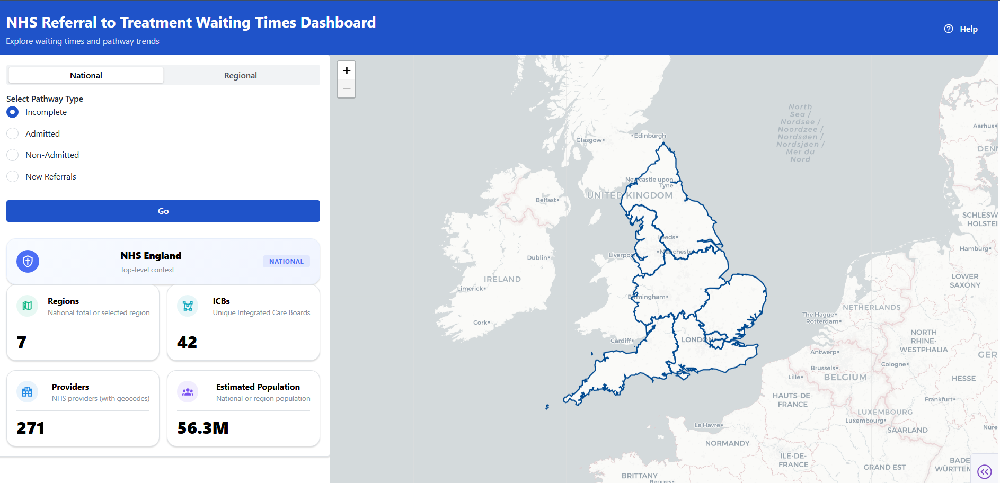

# NHS Performance Dashboard

An interactive dashboard for exploring **Referral to Treatment (RTT) waiting times** across NHS England, built using [Dash](https://dash.plotly.com/).  

The dashboard tracks waiting-time performance across four RTT pathways:  
- **Incomplete** (patients still waiting to start treatment)  
- **Admitted** (patients treated with hospital admission)  
- **Non-Admitted** (patients treated without admission)  
- **New Referrals** (new RTT ‘clock starts’)  

It provides interactive charts, regional comparisons, and deprivation analysis (linking NHS performance with Index of Multiple Deprivation scores).

---


## Project Structure

```
nhs-performance-dashboard/
├── src/
│ ├── app.py # Main Dash app entry point
│ ├── assets/ # CSS, JavaScript, images, and static assets
│ ├── callbacks/ # Dash callbacks for each RTT pathway
│ ├── layouts/ # Page layouts for each RTT pathway
│ ├── queries.py # Data query + transformation functions
│ ├── utils/ # Helper functions, constants, and help text
│ └── db.py # Database connections to postgres
│
├── notebooks/ # Jupyter notebooks for early exploration, and python ingestion scripts to load into db
├── data/ # Cleaned datasets used in the dashboard
├── final_outputs/ # Plots, screenshots, and exports
├── docs/ # Documentation, notes, and methodology
├── sql/ # SQL scripts to create database and tables for dashboard
├── README.md # Project overview (this file)
└── .gitignore # Ignore rules (envs, caches, raw data, etc.)
```

---

## Current Features

- Separate **layouts and callbacks** for each RTT pathway.  
- **Interactive visualisations** with Plotly (line charts, bar charts, scatter plots, maps).  
- **Regional drilldowns** by NHS Region and Integrated Care Board (ICB).  
- **Deprivation analysis** using 2019 IMD data, mapped to NHS geographies.  
- Integrated **help text and contextual guidance** built into the dashboard.  
- Modular structure (`callbacks/`, `layouts/`, `utils/`) for maintainability.  

---

## Initial Prototype (archived)

The project began with a prototype built in [Panel](https://panel.holoviz.org/).  
That prototype demonstrated NHS performance visualisation using static maps and charts, focusing on RTT waiting times and healthcare inequalities.  

Due to GitHub file-size limits, the notebook and exported HTML are hosted externally:  

📄 [View the notebook](https://drive.google.com/file/d/19xUcODQmzShdZ8sbqDxH0jN0bI_elnYG/view?usp=drive_link)  
🌐 [View the exported HTML](https://drive.google.com/file/d/19xUcODQmzShdZ8sbqDxH0jN0bI_elnYG/view?usp=drive_link)  

This prototype informed the design, but the final dashboard is being rebuilt in **Dash** for improved performance, modularity, and scalability.  

---

## Tech Stack

- **Dash** (Plotly) for app framework  
- **Plotly Express & Graph Objects** for charts  
- **Dash Leaflet** for geographic visualisation  
- **Dash Mantine Components** and **Dash Iconify** for UI and help features  
- **Dash Bootstrap Components** for responsive layouts and styling  
- **Pandas** for data wrangling  

---

## Example Output

